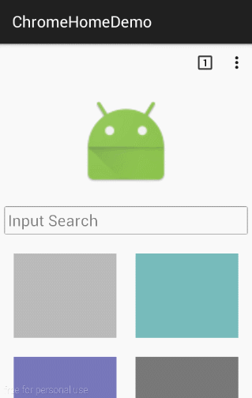

# TransitionPlayer
Android library to control Transition animates. A simple way to create a interactive animation.


## Demo1 SimpleTransition

### Code:
```java
    ......
    TransitionManager.beginDelayedTransition(mSceneRoot, transitionPlayer);

    imageView.setRotation(360);
    imageView.setRotationX(270);
    imageView.setRotationY(180);
    imageView.setTranslationX(70 * getResources().getDisplayMetrics().density);
    imageView.setScaleX(0.2f);
    imageView.setScaleY(0f);
    imageView.setBackgroundColor(getResources().getColor(android.R.color.holo_blue_bright));
    ......
    drawerLayout.setDrawerListener(new DrawerLayout.SimpleDrawerListener() {
        public void onDrawerSlide(View drawerView, float slideOffset) {
            transitionPlayer.setCurrentFraction(slideOffset);
        }
    });
```

## Demo2 MaterialMenu

### Code:
```java
    ......
    int[] layouts = new int[]{R.layout.material_menu_option, R.layout.material_menu_back, R.layout.material_menu_y};
    Scene scene = Scene.getSceneForLayout(mSceneRoot, layout[random.nextInt(layouts.length)], context);
    TransitionManager.go(scene, transitionPlayer);
    ......
    drawerLayout.setDrawerListener(new DrawerLayout.SimpleDrawerListener() {
        public void onDrawerSlide(View drawerView, float slideOffset) {
            transitionPlayer.setCurrentFraction(slideOffset);
        }
    });
```


## Demo3 ChromeAppIndexPage

### Code:
[ChromeHomeDemo.java](demo/src/main/java/com/linfaxin/transitionplayer/demo/ChromeHomeDemo.java)


## License

MIT License.
